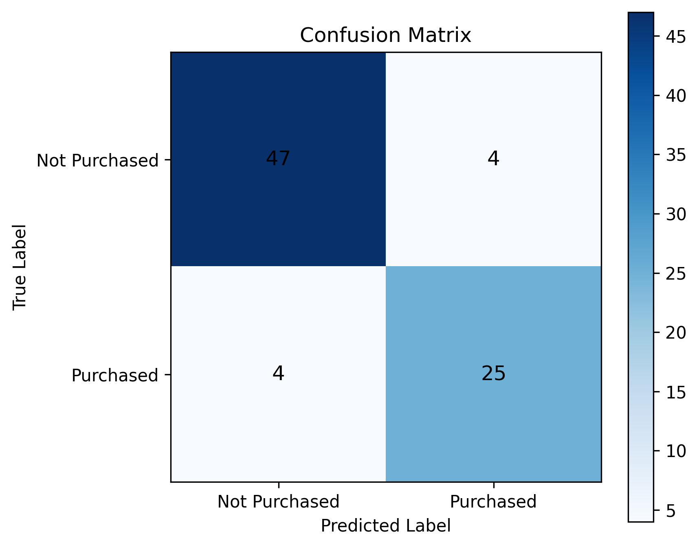

# K-Nearest Neighbors (KNN) — Social Network Ads Classifier

A from-scratch implementation of the **K-Nearest Neighbors** algorithm in Python, applied to the classic *Social Network Ads* dataset to predict whether a user will purchase a product based on their **Age** and **Estimated Salary**.

This project does **not** use `sklearn`'s built-in KNN classifier — the algorithm itself (distance calculation, neighbor voting) is implemented manually in `k_nearest_neighbors.py`. `sklearn` is only used for preprocessing, train/test splitting, and evaluation metrics.

This project implements the K-Nearest Neighbors (KNN) classification algorithm from scratch using Python. The model predicts whether a customer is likely to purchase a product based on Age and Estimated Salary. The project includes data analysis, preprocessing, model training, evaluation, and visualization without using sklearn's built-in KNN classifier.


## 📂 Project Structure

```
KNN-Social-Network-Ads/
│
├── data/
│   └── Social_Network_Ads.csv
│
├── models/
│   └── knn.py
│
├── notebooks/
│   ├── 01_EDA.ipynb
│   └── 02_Data_Preprocessing.ipynb
│
├── outputs/
│   ├── decision_boundary.png
│   └── confusion_matrix.png
│
├── train.py
├── requirements.txt
├── README.md
└── LICENSE               # Project documentation
```


✔ Exploratory Data Analysis (EDA)
✔ Data Preprocessing
✔ Custom KNN Implementation
✔ Manual Euclidean Distance
✔ Feature Scaling
✔ Model Evaluation
✔ Confusion Matrix
✔ Classification Report
✔ Decision Boundary Visualization
✔ Confusion Matrix Heatmap
✔ Live Customer Prediction

## ⚙️ How It Works

### 1. Custom KNN Class (`k_nearest_neighbors.py`)
- `fit(X_train, y_train)` — stores training data.
- `predict(X_test)` — for every test point, computes **Euclidean distance** to all training points, picks the `k` nearest, and returns the **majority class** among them.
- `classify(distance)` — uses `collections.Counter` to find the most common label among the k nearest neighbors.

### 2. Main Pipeline (`main.py`)
1. Load the dataset and select **Age** and **Estimated Salary** as features (columns 2–3).
2. Split data into training (80%) and testing (20%) sets.
3. Scale features using `StandardScaler`.
4. Train the custom KNN model with `k=5`.
5. Evaluate using **Accuracy**, **Confusion Matrix**, and **Classification Report**.
6. Take live user input (age, salary) and predict purchase decision.
7. Plot the **decision boundary** using `matplotlib`.

---

## 📊 Dataset

The `Social_Network_Ads.csv` dataset contains:

| Column          | Description                          |
|------------------|---------------------------------------|
| User ID          | Unique identifier (not used)          |
| Gender           | Not used in this model                |
| Age              | Feature used for prediction           |
| EstimatedSalary  | Feature used for prediction           |
| Purchased        | Target label (0 = No, 1 = Yes)        |

---

## 🛠️ Requirements

Install dependencies before running:

```bash
pip install requirements.txt
```


## ▶️ Usage

```bash
python train.py
```

You will see, in order:
1. Model accuracy and confusion matrix printed in the terminal.
2. A prompt asking for **age** and **salary** to get a live purchase prediction.
3. A full classification report.
4. A decision boundary plot showing how the model separates the two classes.


## 📈 Sample Output

```
Model initialized successfully

Model Performance

Confusion Matrix: [[47  4]
 [ 4 25]]
Accuracy : 0.9000

Classification Report
              precision    recall  f1-score   support

           0       0.92      0.92      0.92        51
           1       0.86      0.86      0.86        29

    accuracy                           0.90        80
   macro avg       0.89      0.89      0.89        80
weighted avg       0.90      0.90      0.90        80

Enter your age: 55
Enter your salary: 88000
Customer is likely to purchase the product.
```
## Visual Results
   
   
## ⚠️ Known Limitations

- **No `random_state`** is set in `train_test_split`, so accuracy and confusion matrix values will differ slightly on every run.
- **Brute-force distance calculation** — the algorithm computes distance to *every* training point for *every* test point (`O(n_train × n_test)`), which can be slow when generating the decision boundary (since it predicts thousands of meshgrid points).
- **Blocking input** — `predict_new()` uses `input()`, which pauses script execution before the classification report and plot are generated. Consider moving it to the end of the script if you want uninterrupted execution.
- Only 2 features (**Age**, **Salary**) are used; `Gender` is ignored.


## 🚀 Possible Improvements

- Vectorize distance computation using NumPy broadcasting for faster predictions.
- Add cross-validation to choose the optimal value of `k`.
- Allow weighted voting (closer neighbors count more).
- Save/load trained model using `pickle`.

---

## 📜 License

This project is open-source and free to use for educational purposes.
